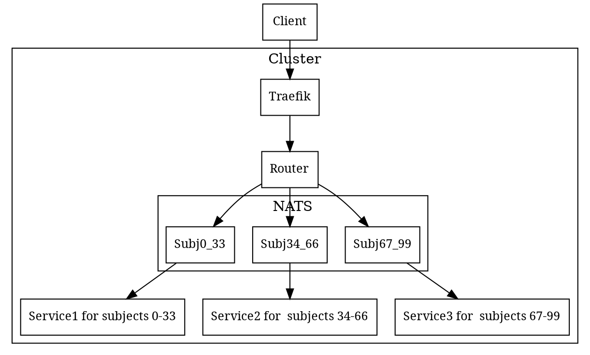

# airs-ibus

## Bus object exchange protocol
Objects could be transferred over bus using IResultSender.

| data type     | over []byte chan                                             | over intf chan|
| --------------|-------------------------------------------------------------:|--------------:|
| []byte        | []byte as is                                                 | []byte as is  |   
| Map section   | {0 (BusPacketType), `sectionName`, [`path`], 0 (end marker)} | &ibus.Section |
| Map element   | {1, `name`, `jsonBytes`                                      | &ibus.Element |
| Array section | {2, `sectionName`, [`path`], 0}                              | &ibus.Section |
| Array element | {2, `jsonBytes`}                                             | &ibus.Element |
| Object section| {3, `sectonName`, [`path`], 0, 1, `jsonBytes`}               | &ibus.Section then &ibus.Element |

## Bus diagram
